<div align="center">

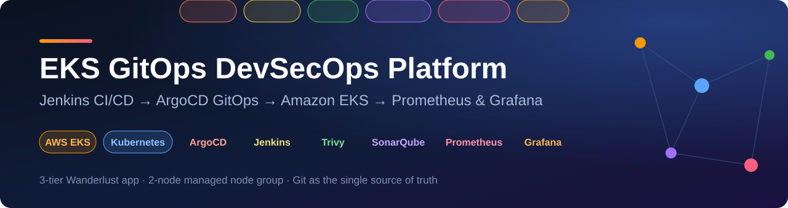

<p><b>A production-style delivery platform on AWS:</b> Jenkins builds and scans, ArgoCD deploys from Git, and Prometheus and Grafana watch a 3-tier app running on a 2-node Amazon EKS cluster.</p>

<p>


</p>
<p>


<a href="https://github.com/ArslanNagori/EKS-GitOps-DevSecOps-Platform/actions/workflows/lint.yml"></a>
<a href="LICENSE"></a>
</p>

<p>
<a href="#overview">Overview</a> &nbsp;·&nbsp;
<a href="#architecture">Architecture</a> &nbsp;·&nbsp;
<a href="#how-a-change-reaches-the-cluster">Delivery flow</a> &nbsp;·&nbsp;
<a href="#results">Results</a> &nbsp;·&nbsp;
<a href="#devsecops-gates">DevSecOps</a> &nbsp;·&nbsp;
<a href="#screenshots">Screenshots</a> &nbsp;·&nbsp;
<a href="#quick-start">Quick start</a> &nbsp;·&nbsp;
<a href="#roadmap">Roadmap</a>
</p>

</div>

---

## Overview

This project takes a 3-tier application (React, Node.js, MongoDB, Redis) from a Git push to a running, monitored workload on **Amazon EKS**, with no manual deploy step in between.

- **Jenkins** (on a master EC2 instance) runs a DevSecOps CI pipeline: Trivy, OWASP Dependency-Check and SonarQube with a quality gate, then builds and pushes the Docker images.
- A **CD job** commits the new image tags to the manifests in Git. Jenkins never runs `kubectl apply`.
- **ArgoCD**, running inside the cluster, detects the commit and syncs it, so Git is the single source of truth.
- The cluster itself is created from the master machine with **eksctl** (CloudFormation underneath): a managed control plane, a 2-node managed node group and an OIDC provider.
- **Prometheus, Alertmanager and Grafana** (Helm `kube-prometheus-stack`) give metrics and dashboards for the nodes and the application.

This is the second part of a pair. Part 1 is the [Jenkins DevSecOps pipeline](https://github.com/ArslanNagori/DevSecOps-CI-CD-Pipeline) that feeds this deployment.

<div align="center">

<table>
<tr>
<td align="center" width="33%"><h2>~19 min</h2><sub>first <code>eksctl</code> command to<br>2 Ready worker nodes</sub></td>
<td align="center" width="33%"><h2>26 pods</h2><sub>running on 2 nodes<br>across 7 namespaces</sub></td>
<td align="center" width="33%"><h2>10 / 0</h2><sub>ArgoCD resources<br>Synced / OutOfSync</sub></td>
</tr>
<tr>
<td align="center"><h2>5 / 5</h2><sub>consecutive green CI builds,<br>about 51 s average run</sub></td>
<td align="center"><h2>Gate passed</h2><sub>SonarQube quality gate,<br>0 bugs, 0 hotspots</sub></td>
<td align="center"><h2>3.7% / 43%</h2><sub>cluster CPU / memory use<br>with the full stack running</sub></td>
</tr>
</table>

</div>

## Architecture

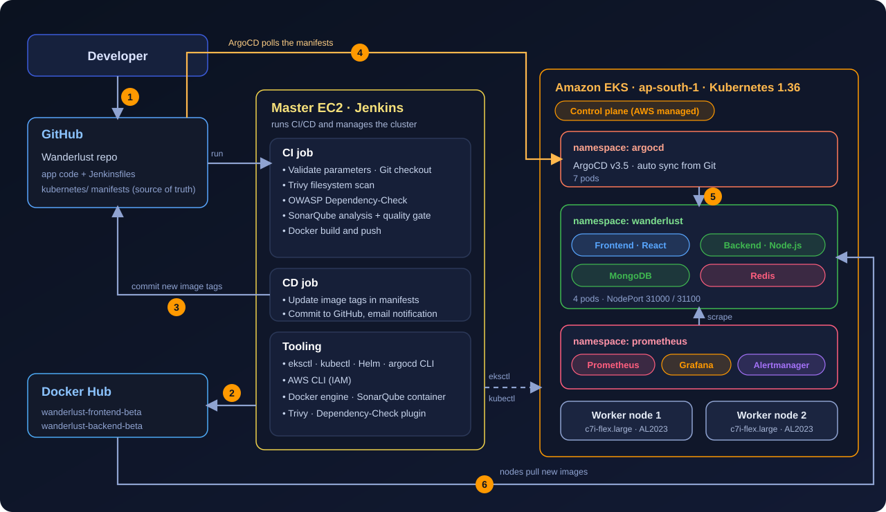

| Where | What runs there |
| --- | --- |
| **Master EC2 instance** | Jenkins, Docker, SonarQube, Trivy, OWASP Dependency-Check, AWS CLI, eksctl, kubectl, Helm, argocd CLI |
| **EKS control plane** (AWS managed) | API server, etcd, scheduler, controller manager |
| **Worker nodes** (2 x `c7i-flex.large`, Amazon Linux 2023) | `kube-system` add-ons, ArgoCD, the Wanderlust app, the Prometheus stack |
| **External** | GitHub (code and manifests), Docker Hub (images), email (notifications) |

Details and design reasoning: [docs/architecture.md](docs/architecture.md).

## How a change reaches the cluster

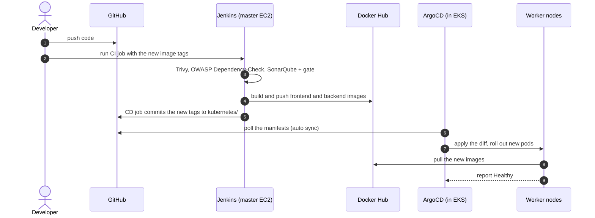

The ReplicaSet history in the cluster shows the result: three revisions each for the frontend and backend, with the older ones scaled to zero. Walkthrough, demo script and rollback: [docs/gitops-workflow.md](docs/gitops-workflow.md).

## Results

| Area | Outcome |
| --- | --- |
| Cluster build | EKS control plane about 11 min, managed node group about 3 min, about 19 min from the first command to 2 Ready nodes |
| Workload | 4 application pods (frontend, backend, MongoDB, Redis), spread over both nodes. 26 pods in total with ArgoCD, monitoring and `kube-system` |
| GitOps | Application Healthy and Synced to `main` with auto sync on. The last sync was a Jenkins commit, "Update image tags in Kubernetes manifests" |
| Releases | Images `wanderlust-backend-beta:v3.3` and `wanderlust-frontend-beta:v3.3` rolled out from Git commits, with no manual `kubectl apply` for app releases |
| CI | 5 consecutive successful builds, about 51 s average run with warm caches |
| Resource use | The whole stack ran at about 3.7% CPU and 43% memory. The application itself used under 0.5% of cluster CPU |

## DevSecOps gates

Every CI run executes these checks before an image is built:

| Gate | Tool | Result on this project |
| --- | --- | --- |
| Filesystem and dependency scan | Trivy | 69 HIGH/CRITICAL findings in npm lock files (34 backend, 32 frontend, 3 root) |
| Software composition analysis | OWASP Dependency-Check | 109 findings: 2 critical, 48 high, 52 medium, 7 low |
| Static analysis and quality gate | SonarQube | Gate **Passed**: 0 bugs, 1 vulnerability, 0 hotspots, 2 code smells, 6.1% duplication, 0% test coverage |

The scans currently report without failing the build, and the app has no unit tests yet. Both are listed honestly in the [roadmap](#roadmap). Stage timings and details: [docs/devsecops-pipeline.md](docs/devsecops-pipeline.md).

## Screenshots

**Featured**

<table>
<tr><td width="100%" align="center"><a href="screenshots/argocd-application-synced-healthy.png">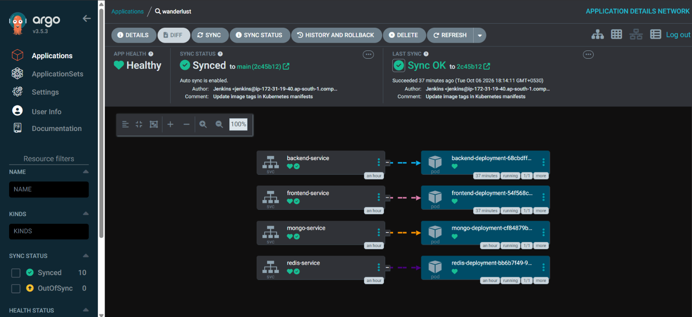</a><br><sub><b>ArgoCD: Healthy and Synced to main. The last sync is a commit authored by Jenkins</b></sub></td></tr>
</table>

<details>
<summary><b>Cluster and application (6 screenshots)</b></summary>
<br>

<table>
<tr><td width="50%" align="center"><a href="screenshots/eks-cluster-overview.png">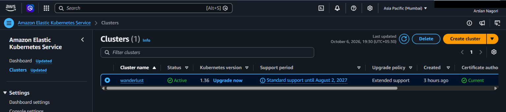</a><br><sub><b>EKS cluster active, Kubernetes 1.36</b></sub></td><td width="50%" align="center"><a href="screenshots/eks-worker-nodes.png">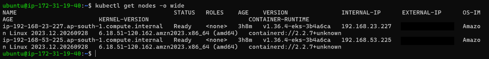</a><br><sub><b>Two worker nodes Ready</b></sub></td></tr>
<tr><td width="50%" align="center"><a href="screenshots/wanderlust-kubernetes-workloads.png">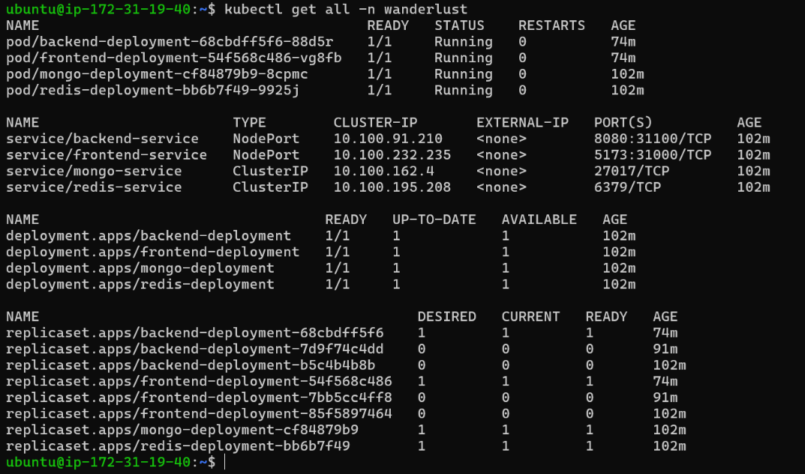</a><br><sub><b>All resources in the wanderlust namespace</b></sub></td><td width="50%" align="center"><a href="screenshots/wanderlust-pods.png">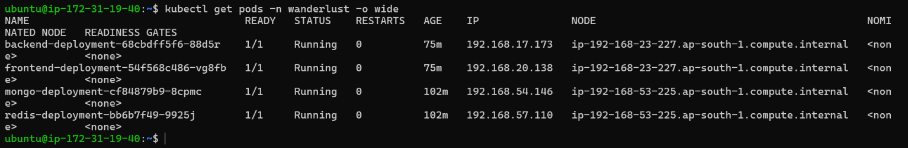</a><br><sub><b>Pods spread across both nodes</b></sub></td></tr>
<tr><td width="50%" align="center"><a href="screenshots/wanderlust-live-application.png">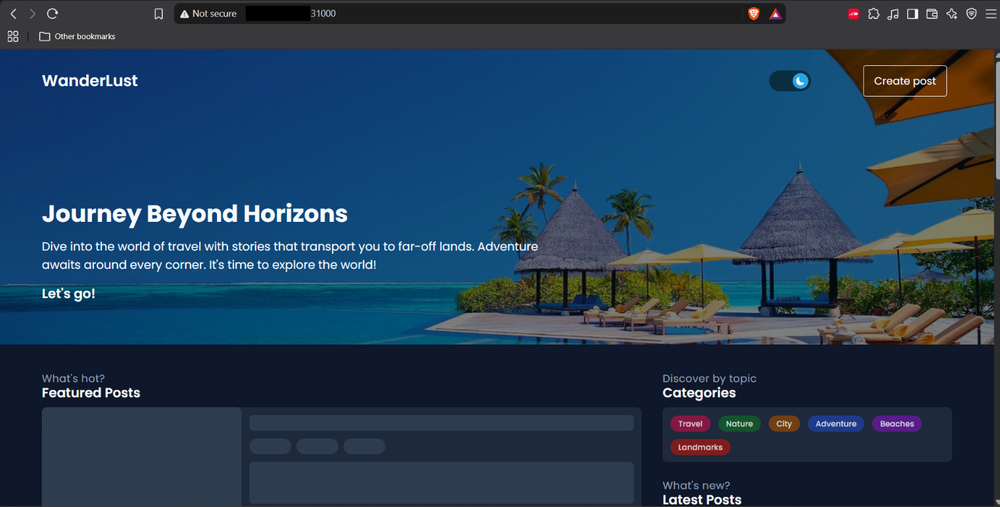</a><br><sub><b>Application served from the cluster</b></sub></td><td width="50%" align="center"><a href="screenshots/argocd-application-details.png">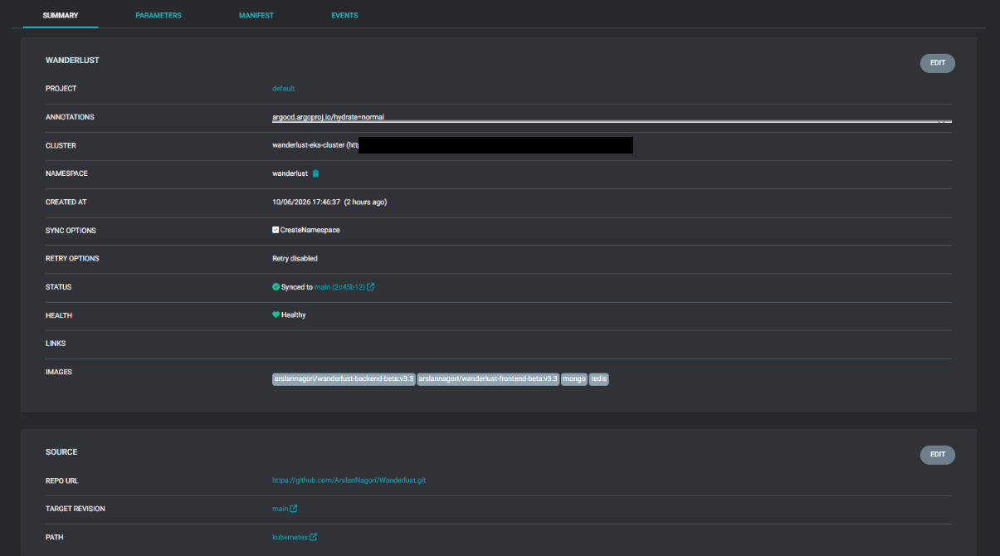</a><br><sub><b>Git source, namespace and image tags</b></sub></td></tr>
</table>

</details>

<details>
<summary><b>CI/CD with Jenkins (6 screenshots)</b></summary>
<br>

<table>
<tr><td width="50%" align="center"><a href="screenshots/jenkins-ci-stage-view.png">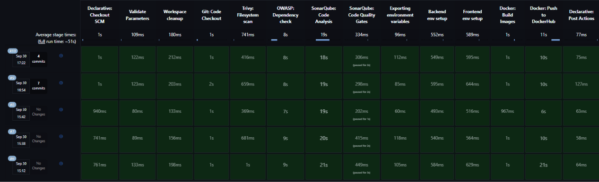</a><br><sub><b>Jenkins CI stage view</b></sub></td><td width="50%" align="center"><a href="screenshots/jenkins-build-history.png">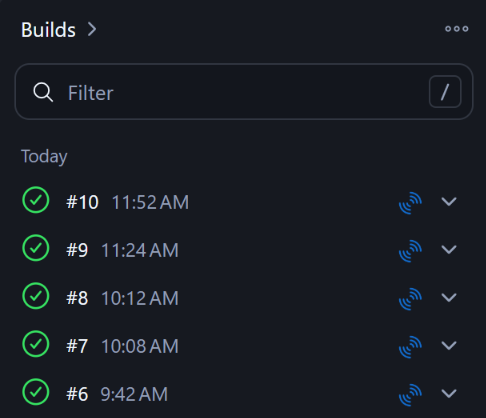</a><br><sub><b>Five successful builds in a row</b></sub></td></tr>
<tr><td width="50%" align="center"><a href="screenshots/jenkins-cd-commit.png">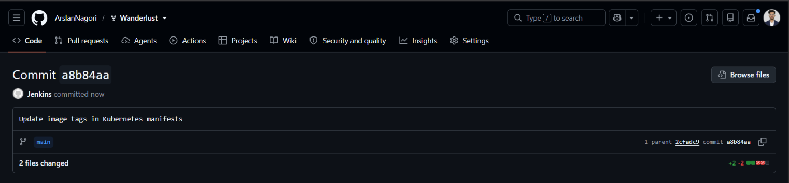</a><br><sub><b>Jenkins commit to the manifests repo</b></sub></td><td width="50%" align="center"><a href="screenshots/jenkins-cd-manifest-diff.png"></a><br><sub><b>Image-tag change in backend and frontend</b></sub></td></tr>
<tr><td width="50%" align="center"><a href="screenshots/dockerhub-images.png">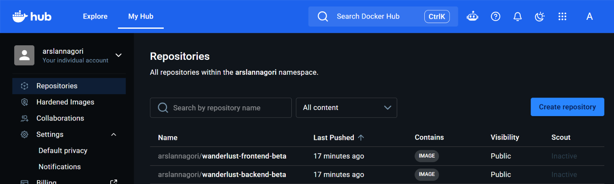</a><br><sub><b>Images pushed to Docker Hub</b></sub></td><td width="50%" align="center"><a href="screenshots/jenkins-shared-library-config.png">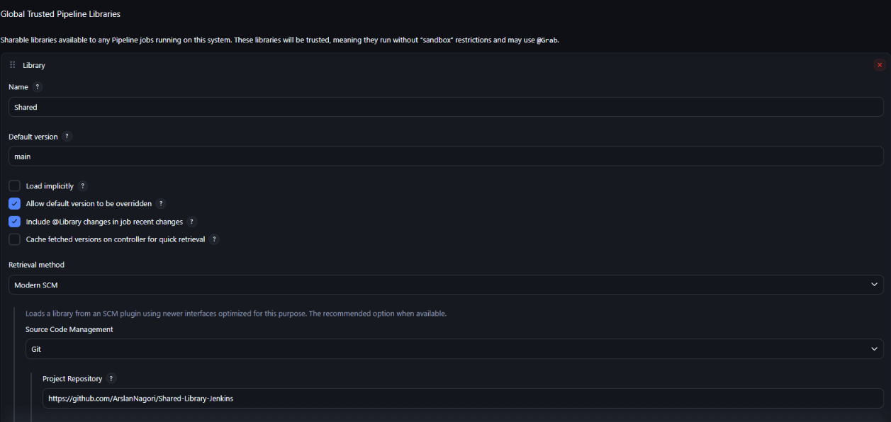</a><br><sub><b>Shared pipeline library configuration</b></sub></td></tr>
</table>

</details>

<details>
<summary><b>DevSecOps checks (3 screenshots)</b></summary>
<br>

<table>
<tr><td width="50%" align="center"><a href="screenshots/sonarqube-dashboard.png">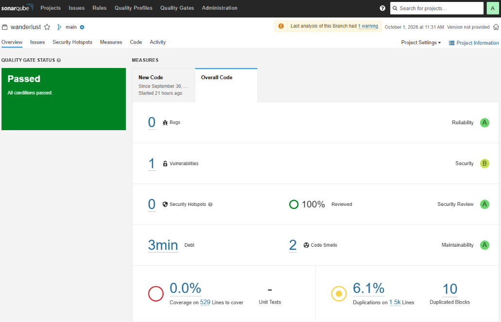</a><br><sub><b>SonarQube: quality gate passed</b></sub></td><td width="50%" align="center"><a href="screenshots/dependency-check-report.png">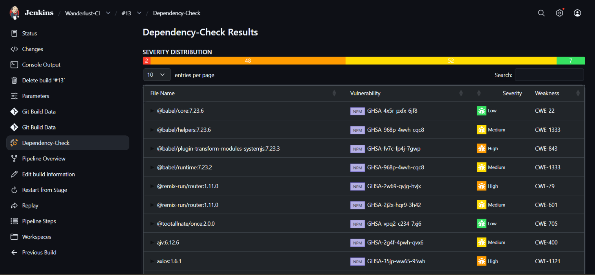</a><br><sub><b>OWASP Dependency-Check results</b></sub></td></tr>
<tr><td width="100%" align="center"><a href="screenshots/trivy-fs-report.png">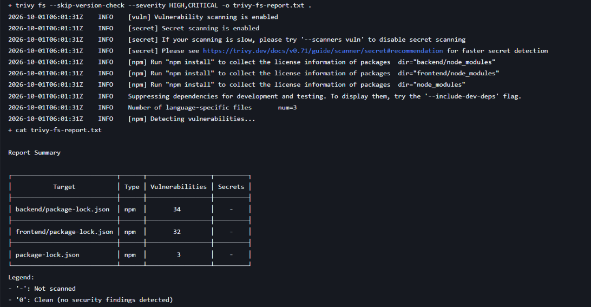</a><br><sub><b>Trivy filesystem scan: 69 HIGH/CRITICAL</b></sub></td></tr>
</table>

</details>

<details>
<summary><b>Monitoring with Prometheus and Grafana (5 screenshots)</b></summary>
<br>

<table>
<tr><td width="50%" align="center"><a href="screenshots/grafana-cluster-overview.png">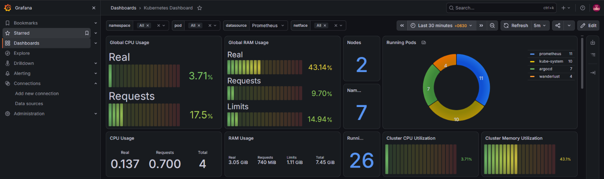</a><br><sub><b>Grafana: 2 nodes, 26 pods, cluster CPU and memory</b></sub></td><td width="50%" align="center"><a href="screenshots/grafana-namespace-cpu-memory.png">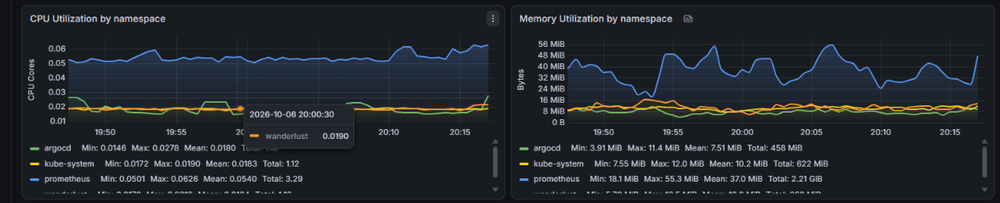</a><br><sub><b>Grafana: CPU and memory by namespace</b></sub></td></tr>
<tr><td width="50%" align="center"><a href="screenshots/prometheus-wanderlust-cpu-usage.png">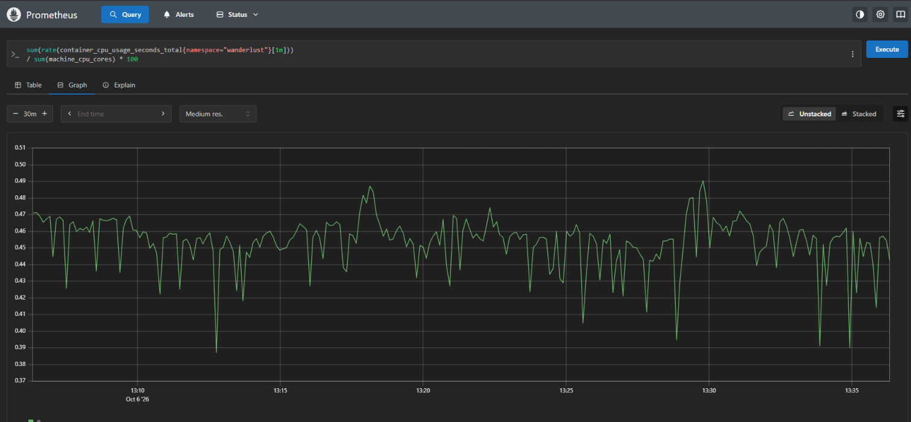</a><br><sub><b>Prometheus: CPU of the wanderlust namespace</b></sub></td><td width="50%" align="center"><a href="screenshots/prometheus-network-receive-by-pod.png">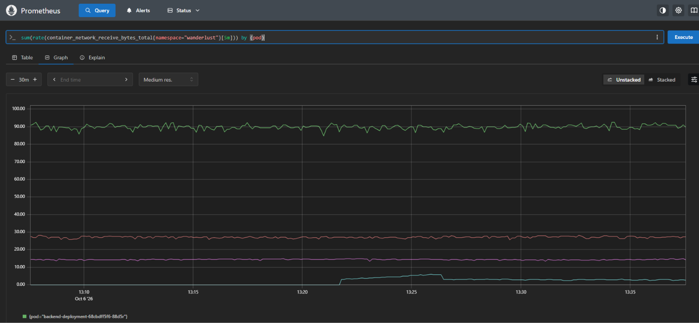</a><br><sub><b>Prometheus: network receive per pod</b></sub></td></tr>
<tr><td width="100%" align="center"><a href="screenshots/prometheus-network-transmit-by-pod.png">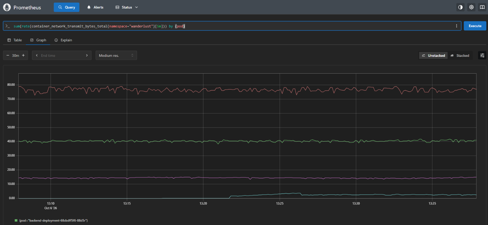</a><br><sub><b>Prometheus: network transmit per pod</b></sub></td></tr>
</table>

</details>


Every screenshot, with what it proves, is listed in [screenshots/README.md](screenshots/README.md).

## Tech stack

| Layer | Tools |
| --- | --- |
| Cloud | AWS EKS, EC2, IAM (OIDC provider), VPC, CloudFormation (through eksctl) |
| CI/CD | Jenkins with a shared library, Docker, Docker Hub |
| GitOps | ArgoCD v3.5 |
| Security | Trivy, OWASP Dependency-Check, SonarQube |
| Observability | Prometheus, Alertmanager, Grafana, kube-state-metrics, node-exporter (Helm `kube-prometheus-stack`) |
| Cluster add-ons | vpc-cni, kube-proxy, CoreDNS, metrics-server |
| Application | Wanderlust: React, Node.js, MongoDB, Redis |
| Tooling | Bash, Make, GitHub Actions (ShellCheck and yamllint) |

## Quick start

You need an AWS account and a master EC2 instance with Jenkins (see [Part 1](https://github.com/ArslanNagori/DevSecOps-CI-CD-Pipeline)), plus an EC2 key pair for the nodes.

```bash
git clone https://github.com/ArslanNagori/EKS-GitOps-DevSecOps-Platform.git
cd EKS-GitOps-DevSecOps-Platform

make tools                      # AWS CLI, kubectl, eksctl, Helm, argocd CLI
export KEY_PAIR=<your-ec2-key-pair>
make cluster                    # EKS control plane + 2-node managed node group
make argocd                     # install ArgoCD (NodePort)
make register                   # register the cluster with ArgoCD
make app                        # create the ArgoCD Application
make monitoring                 # Prometheus, Alertmanager, Grafana
make destroy                    # delete everything to stop billing
```

Step-by-step version with explanations: [docs/setup-guide.md](docs/setup-guide.md).

## Repository layout

```
.
├── argocd/application.yaml        ArgoCD Application (Git source, destination, sync policy)
├── jenkins/                       Jenkinsfile-ci, Jenkinsfile-cd
├── scripts/                       install-tools, create-cluster, install-argocd, install-monitoring, cleanup
├── docs/                          architecture, setup, GitOps, DevSecOps, monitoring, security, cost, troubleshooting
│   └── assets/                    banner and architecture diagram (SVG)
├── screenshots/                   21 proof screenshots, indexed in screenshots/README.md
├── reports/                       Trivy filesystem scan output
├── Makefile                       one-command entry points
└── .github/workflows/lint.yml     ShellCheck and yamllint on every push
```

## Design decisions and trade-offs

| Decision | Why | Trade-off |
| --- | --- | --- |
| ArgoCD runs inside the cluster and pulls from Git | Git is the source of truth, every change is a reviewable commit, and the app keeps syncing even if the master machine is stopped | Needs repo access from the cluster |
| Jenkins only edits image tags | Separates build from deploy and keeps `kubectl` credentials out of the pipeline | One extra commit per release |
| Managed node group created with eksctl | One reproducible command, AWS handles node lifecycle | Less control than self-managed nodes |
| OIDC provider enabled | Allows IAM roles for service accounts later (EBS CSI, Load Balancer Controller) | None for this scope |
| NodePort for the demo tools | No extra load balancer cost during a learning project | No TLS or DNS; access limited by security group |
| 2 x `c7i-flex.large` nodes | The full stack used about 43% of memory, so 4 GB nodes are enough and still show multi-node scheduling | Little headroom for more workloads |

## Challenges solved

| Problem | Cause | Fix |
| --- | --- | --- |
| ArgoCD install failed with `metadata.annotations: Too long` and the ApplicationSet controller kept restarting | A plain `kubectl apply` stores the object in an annotation, and this CRD exceeds the 262144-byte limit | `kubectl apply --server-side --force-conflicts` |
| Grafana showed 32 in the pod chart but 26 running pods | The pie chart counts containers, the tile counts pods | Verified against `kubectl get pods -A`: 7 ArgoCD + 4 app + 7 monitoring + 8 `kube-system` = 26 |
| `argocd login` failed on the certificate | Self-signed certificate without an IP SAN when connecting by IP | `--insecure` for the lab, a real certificate for production |
| `aws configure` saved a garbage region | Pasted installer output was consumed as prompt answers | Re-ran `aws configure` alone; documented the pitfall |

More in [docs/troubleshooting.md](docs/troubleshooting.md) and [docs/lessons-learned.md](docs/lessons-learned.md).

## Roadmap

- [ ] Make the security gates enforcing: fail the build on critical findings and add an image scan after the build
- [ ] Add unit tests so the SonarQube coverage figure is no longer 0%
- [ ] Deploy to `https://kubernetes.default.svc` instead of the registered cluster, and remove the extra `argocd-manager` service account and token
- [ ] Replace NodePort with the AWS Load Balancer Controller, an Ingress and TLS
- [ ] Turn on ArgoCD `selfHeal` and `prune`, and add ArgoCD notifications
- [ ] Provision the master machine, IAM and the cluster with Terraform
- [ ] Add Horizontal Pod Autoscaling using the metrics-server add-on
- [ ] Alertmanager routes for email or Slack

## Skills demonstrated

| Area | Evidence in this repo |
| --- | --- |
| Kubernetes on AWS | EKS cluster, managed node group, add-ons, OIDC, workload placement across nodes |
| GitOps | ArgoCD application, auto sync, Git as the deployment trigger, rollback by `git revert` |
| CI/CD | Parameterized Jenkins pipelines with a shared library, CI to CD hand-off |
| DevSecOps | Trivy, OWASP Dependency-Check, SonarQube quality gate in the pipeline |
| Observability | Prometheus queries, Grafana dashboards, kube-state-metrics and node-exporter |
| Automation | Idempotent Bash scripts, Makefile, ShellCheck and yamllint in GitHub Actions |
| Cost and security awareness | Cleanup script, cost notes, hardening checklist, no secrets in the repo |
| Documentation | Architecture, runbook, troubleshooting and lessons learned |

## Cost and cleanup

EKS bills by the hour for the control plane, plus the worker nodes, the master instance, volumes and public IPs. This environment is meant to be temporary: run `make destroy` (or `scripts/cleanup.sh`) when you finish. Details: [docs/cost-and-cleanup.md](docs/cost-and-cleanup.md).

## Credits

The Wanderlust application and its base Kubernetes manifests come from the open-source [Wanderlust-Mega-Project](https://github.com/LondheShubham153/Wanderlust-Mega-Project) by LondheShubham153. The cluster build, pipelines, ArgoCD setup, monitoring, scripts and documentation in this repo are my own work.

---

<div align="center">

**Arslan Nagori** · Final-year B.Tech CSE student, building towards a DevOps Engineer role

[LinkedIn](https://www.linkedin.com/in/arslannagori/) &nbsp;·&nbsp; [GitHub](https://github.com/ArslanNagori) &nbsp;·&nbsp; [Part 1: DevSecOps CI/CD Pipeline](https://github.com/ArslanNagori/DevSecOps-CI-CD-Pipeline)

</div>
